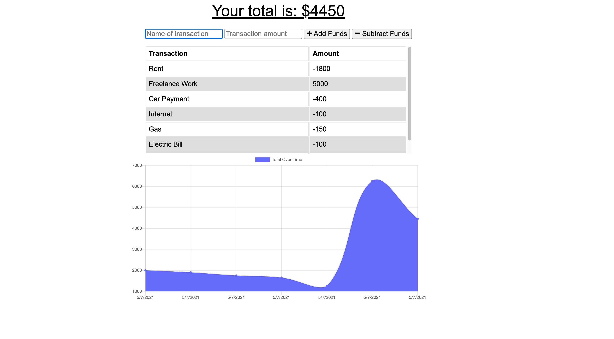

# **Budget Tracker** 

## **Description**
Simple application to help keep track of your Budget, with offline capabilities. 

## **Table of Contents**
* [Application](#application)
* [Technology](#technology)
* [License](#license)
* [Contact](#contact)

### **Application**

Deployed: [Budget-Tracker-PWA](https://serene-citadel-29504.herokuapp.com/)

### **Technology**
* MongoDB
* Mongoose
* Manifest
* Service Workers
* IndexedDB
* Node.js
* Express.js
* Javascript
* HTML
* CSS

### **License**
[ISC](https://opensource.org/licenses/ISC)

### **Contact**
* Github: [agustinxmtz](https://github.com/agustinxmtz)
* LinkedIn: [Agustin Martinez](https://www.linkedin.com/in/agustin-martinez-6282aa1b3/)
* Email: agustinxmtz@gmail.com